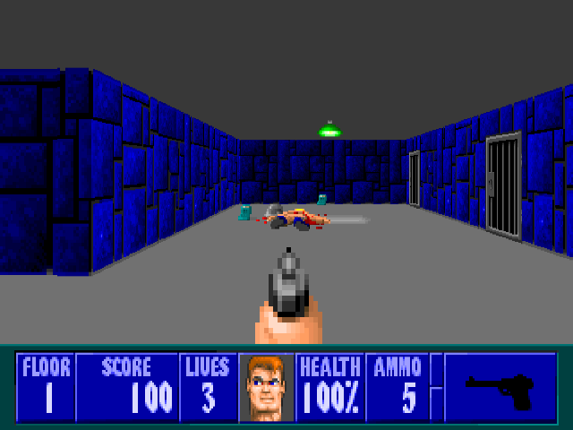

Crispy Wolfenstein 3D
========================



Crispy Wolfenstein 3D is a WIP enhanced Wolfenstein 3D source port for modern platforms. It is based on 
[Wolf4SDL](https://github.com/AryanWolf3D/Wolf4SDL/).

It is designed to be a faithful experience of the original game while also featuring some
improvements and enhancements. This means features that weren't present in the original game have been removed
(such as weather effects, textured floors/ceilings, etc). But, some improvements have been made to make the original 
experience feel good on modern platforms.

Core features are:

* Enhanced 640x400 display resolution which scales up to any screen size.
* Aspect ratio correction to 4:3 (640x480) to emulate what gamers experienced in 1993 on CRTs.
* Support for modern game controllers (Xbox, PS3/PS4, etc) with dual analog stick movement and turning.
* Modern keyboard and mouse controls with WASD movement and mouse turning.
* All the core features are configurable.  

This project is still a WIP and there are a bunch of things to be done before packaged releases:

- [ ] DOS like launcher for Wolf3D and Spear of Destiny episodes.
- [ ] Configure options from an in-game menu (with runtime changes).
- [ ] Support for multiple aspect ratios without stretching the final image. 
- [ ] Configure which game controller to use.  
- [ ] Ports to more modern platforms/game consoles (Serenity, PS Vita, etc).

## Build & Run

### Data Files

First copy your Wolf3D data files into the `data` directory. The files needed are:

```
audiohed
audiot
gamemaps
maphead
vgadict
vgagraph
vgahead
vswap
```

The data files can have the following extensions:

* .wl1 - Wolfenstein 3D shareware version (episode 1 only)
* .wl6 - Wolfenstein 3D full version (episode 1 to 6)
* .sod - Wolfenstein 3D Spear of Destiny demo and full version
* .sd2 - Wolfenstein 3D Spear of Destiny Mission 2: Return to Danger
* .sd3 - Wolfenstein 3D Spear of Destiny Mission 3: Ultimate Challenge

You will need to ensure the game is configured for your version of the data files. You can do this by enabling specific
definitions in the `version.h` file, which has some comments with instructions about what to configure. By default, the
game is configured for the `.wl6` full version data files. If you have the shareware `.wl1` files, then ensure
 `UPLOAD` is defined.

*Note: The game expects the data files to be in lowercase (e.g VSWAP.WL1 -> wswap.wl1). But if your computers filesystem is case
in-sensitive then this won't matter. So if you have all the correct data files, but the game isn't loading them then try
renaming them all to lowercase.*

If you don't have data files, here are some links:
* [Shareware files for Wolfenstein 3D](http://maniacsvault.net/ecwolf/files/shareware/wolf3d14.zip)
* [Shareware files for Spear of Destiny](http://maniacsvault.net/ecwolf/files/shareware/soddemo.zip)
* [Purchase the full game](https://www.gog.com/game/wolfenstein_3d_and_spear_of_destiny?pp=979014556ab8cdd13048702896fb99fcc40fe793)

### OSX

These instructions assume you have Homebrew installed. If you don't, please [install](https://brew.sh/) it.

Install all the required dependencies:

```shell
brew update
brew install cmake sdl2 sdl2_mixer
```

Navigate to the cloned repository and generate the build files:

```shell
mkdir build && cd build
cmake ..
```

Compile the game:

```shell
make -j4
```

Run the game:

```shell
./crispy-wolf3d
```

### Windows

Visual Studio 2019 for C++ has built-in support for CMake projects. So directly opening the project in Visual Studio
and building from there is easiest. If you don't have it you can install it from [here](https://visualstudio.microsoft.com/vs/).

Be sure to generate the CMake cache and select `crispy-wolf3d.exe` as the target.

### Linux

These instructions assume you are using Ubuntu. If you're on a different distribution, ensure you have the
dependencies installed, and the instructions should be identical.

Install all the required dependencies:

```shell
sudo apt update
sudo apt install cmake libsdl2-dev libsdl2-mixer-dev
```

Navigate to the cloned repository and generate the build files:

```shell
mkdir build && cd build
cmake ..
```

Compile the game:

```shell
make -j4
```

Run the game:

```shell
./crispy-wolf3d
```

## Hacking

If you want to modify the source and debug the game, then using an IDE that supports CMake is the easiest way.
I personally use CLion, but on Windows Visual Studio 2019 works well too.

## Play

### Configuration

All new crispy options can be configured via the `crispy-wolf3d.cfg` text file. This file will be located at:

| Windows                         | OSX                     | Linux                   |
|---------------------------------|-------------------------|-------------------------|
| In same directory as executable | `$HOME/.crispy-wolf3d/` | `$HOME/.crispy-wolf3d/` |

### Command Line Arguments

| Option                               | Description                                                                                                  | Value                   |
|--------------------------------------|--------------------------------------------------------------------------------------------------------------|-------------------------|
| `--fullscreen <switch>`              | Switch to decide if game runs in fullscreen                                                                  | Boolean (true or false) |
| `--window_scale <scale>`             | Set the scale of the window (1-4)                                                                            | Unsigned int (1-4)      |
| `--grab_mouse`                       | Grabs the mouse in windowed mode. Always on if fullscreen                                                    | N/A                     |
| `--high_res <switch>`                | Switch to decide if game runs in high res (640x400) or low res (320x200) mode                                | Boolean (true or false) |
| `--aspect_ratio_correction <switch>` | Switch to decide if game uses 4:3 aspect ratio correction                                                    | Boolean (true or false) |
| `--tedlevel <level>`                 | Starts the game in the given level                                                                           | Unsigned int            |
| `--baby`                             | Sets the difficulty to baby for `tedlevel`                                                                   | N/A                     |
| `--easy`                             | Sets the difficulty to easy for `tedlevel`                                                                   | N/A                     |
| `--normal`                           | Sets the difficulty to normal for `tedlevel`                                                                 | N/A                     |
| `--hard`                             | Sets the difficulty to hard for `tedlevel`                                                                   | N/A                     |
| `--nowait`                           | Skips intro screens                                                                                          | N/A                     |
| `--joystick <index>`                 | Use the index-th joystick if available. (-1 to disable joystick, default: 0)                                 | Int                     |
| `--joystickhat <index>`              | Enables movement with the given coolie hat                                                                   | Unsigned int            |
| `--samplerate <rate>`                | Sets the sound sample rate (given in Hz, default:44100)                                                      | Unsigned int            |
| `--audiobuffer <size>`               | Sets the size of the audio buffer (-> sound latency). (given in bytes, default: 2048 / (44100 / samplerate)) | Unsigned int            |
| `--ignorenumchunks`                  | Ignores the number of chunks in VGAHEAD.* (may be useful for some broken mods)                               | N/A                     |
| `--configdir <dir>`                  | Directory where config file and save games are stored                                                        | String                  |
| `--mission <mission>`                | Spear of Destiny mission number to play                                                                      | Unsigned int (0..3)     |
| `--goodtimes`                        | Disable copy protection quiz                                                                                 | N/A                     |

*Note: When setting an option via the command line, it will take preference to what is in the config files.*

### Game Controller Support

With the help of the SDL2 GameController API the game now supports modern controllers (Xbox 360, Xbox One, PS3/PS4, etc).

Here is the button layout for controllers. This is not currently customizable.

| Action                | Button                        |
|-----------------------|-------------------------------|
| Move Forward/Backward | Left-Stick Y-Axis             |
| Strafe Left/Right     | Left-Stick X-Axis             |
| Look Left/Right       | Right-Stick X-Axis            |
| Use                   | A                             |
| Shoot                 | Right-Bumper or Right-Trigger |
| Sprint                | Left-Bumper or Left-Trigger   |
| Cycle Prev Weapon     | Y                             |
| Cycle Next Weapon     | B                             |
| Menu                  | Start                         |

*Note: When using a controller, the game now supports moving and strafing at the same time.*

### Screenshots

You can press the `PrtScn` key at anytime to take a screenshot. The PNG images will be saved to the same directory as
the config.

## Credits

* Based on [Wolf4SDL](https://github.com/AryanWolf3D/Wolf4SDL/).
* Inspired by [Crispy Doom](https://github.com/fabiangreffrath/crispy-doom).  
* Original Wolfenstein 3D by id Software (http://www.idsoftware.com).
